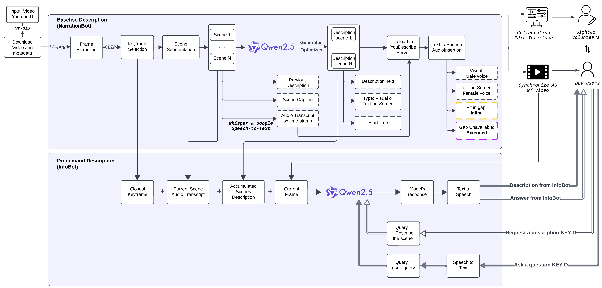

# 🎞️ NarrationBot + InfoBot: Video Description Pipeline

## Introduction
Over 285 million people worldwide are blind or low vision (BLV), relying on audio description (AD) to access visual content. While AD is legally required for professional media like TV and streaming services, no such mandate exists for short-form and user-generated platforms such as YouTube, Instagram, or TikTok.

YouDescribe is one of the few community-driven platforms addressing this gap—allowing BLV users to request ADs, which are then created by volunteers. Despite having over 3,000 contributors and 6,400+ described videos, 92% of videos on YouDescribe’s Wishlist remain undescribed, reflecting the urgent need for scalable, AI-assisted solutions.

Creating AD is time-consuming and creative—it’s not just a task but a form of storytelling. This project presents a VLM-driven, automated AD pipeline enhanced with context-aware prompting, AD guideline adherence, and a human-in-the-loop (HITL) design to support volunteer efforts and improve quality.

## Project Overview
This system generates contextually rich, scalable audio descriptions for YouTube videos using a combination of scene segmentation, transcription, and vision-language models (Qwen2.5-VL). It supports:

1. NarrationBot for baseline AD generation.

2. InfoBot for on-demand, user-triggered visual Q&A. This gives BLV users more agency, enabling them to engage with content actively, rather than passively.


## 🧠 How InfoBot Works

In addition to generating baseline scene descriptions, the system includes **InfoBot**, an on-demand module that allows BLV users to request descriptions or ask questions about any moment in a video.

- Users can **pause the video and press 'D'** to request a contextual scene description.
- They can also **ask natural language questions** (e.g., "What is Uncle Ben wearing?") by pressing 'Q'.
- InfoBot retrieves the current frame, closest keyframe, accumulated prior descriptions, and transcript to build a **context-aware query** for Qwen2.5-VL.
- The model responds with a concise, grounded answer, delivered in real-time via text-to-speech.

This empowers BLV users with greater **agency and interactivity**, transforming them from passive viewers to active participants.

---

## System Architecture



---

## Setup Instructions

1. **Create and activate a Conda environment:**

   ```bash
   conda create -n video_describe python=3.10
   conda activate video_describe
   ```

2. **Install all dependencies:**

   ```bash
   conda env update --file environment.yml
   ```

---

## Running the Pipeline

1. **Run the test pipeline:**

   ```bash
   python test_pipeline.py <youtube_id>
   ```

   Example:
   ```bash
   python test_pipeline.py dQw4w9WgXcQ
   ```

   This will sequentially execute the following modules:

---

## Pipeline Stages

### 1. `youtube_downloader.py`
**Purpose:**  
Downloads the YouTube video and its captions.

**Input:**  
- YouTube video ID

**Output:**  
- `videos/<video_id>/<video_id>.mp4`  
- `videos/<video_id>/<video_id>.json` (captions)

---

### 2. `keyframe_scene_detector.py`
**Purpose:**  
Detects keyframes and scene boundaries using OpenCLIP-based visual similarity.

**Input:**  
- `videos/<video_id>/<video_id>.mp4`

**Output:**  
- `videos/<video_id>/<video_id>_scenes/scene_XXX.mp4`  
- `videos/<video_id>/<video_id>_scenes/scene_info.json`  
- `videos/<video_id>/keyframes/`, `scene_boundaries/`

---

### 3. `transcribe_scenes.py`
**Purpose:**  
Uses Whisper + Google Speech-to-Text to generate timestamped, accurate scene transcripts.

**Input:**  
- Scene MP4s  
- Original captions

**Output:**  
Updates `scene_info.json`:
```json
"transcript": [
  {
    "start": 0.0,
    "end": 2.3,
    "text": "Accurate transcript here..."
  }
]
```

---

### 4. `video_caption.py`
**Purpose:**  
Generates context-aware descriptions using Qwen2.5-VL.

**Input:**  
- `videos/<video_id>`

**Output:**  
- `scene_info.json` with:
```json
"audio_clips": [
  {"type": "Visual", "start_time": ..., "text": "..."}
]
```

---

### 5. `description_optimize.py`
**Purpose:**  
Refines generated descriptions by:
- Shortening inline narration to fit audio gaps  
- Filtering less useful extended descriptions

**Output:**  
- `audio_clips_optimized.json`

---

### 6. `prepare_final_data.py`
**Purpose:**  
Formats data for YouDescribe backend upload.

**Output:**  
- `videos/<video_id>/final_data.json`

---

## ▶️ Running the API Server (InfoBot)

Start the FastAPI server to handle both narration and InfoBot queries:

```bash
python server.py
```

This enables:
- `/api/info-bot` → Real-time description or Q&A
- `/api/generate-ai-description` → Run full narration pipeline
- `/api/newaidescription` → Forward data to YouDescribe server

Make sure you set up:
- `.env` with Qwen2.5-VL and Google STT credentials
- Proper folder structure in `videos/`

---

## Output Structure Summary

```
videos/
└── <video_id>/
    ├── <video_id>.mp4
    ├── <video_id>.json                  # Original captions
    ├── keyframes/
    ├── scene_boundaries/
    ├── <video_id>_scenes/
    │   ├── scene_001.mp4
    │   ├── ...
    │   ├── scene_info.json              # All metadata, transcripts, and audio clips
    │   └── audio_clips_optimized.json   # Final refined narration
    └── final_data.json                  # Ready for upload to YouDescribe
```

---

## Demo Link

👉 [View the Demo on Google Drive](https://drive.google.com/drive/u/0/folders/15aerwlBu9QGTr3FFDca2O574xH9Fh0K6)


---